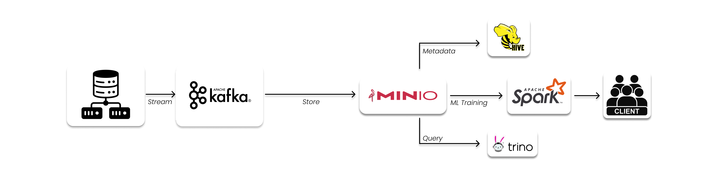
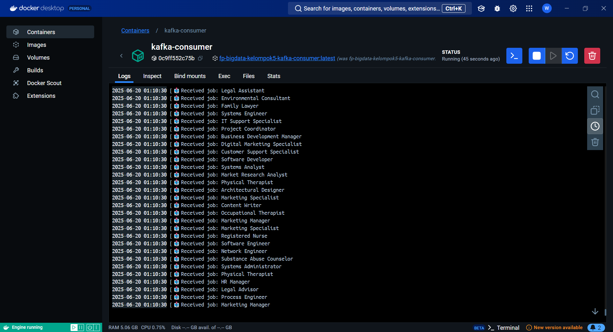
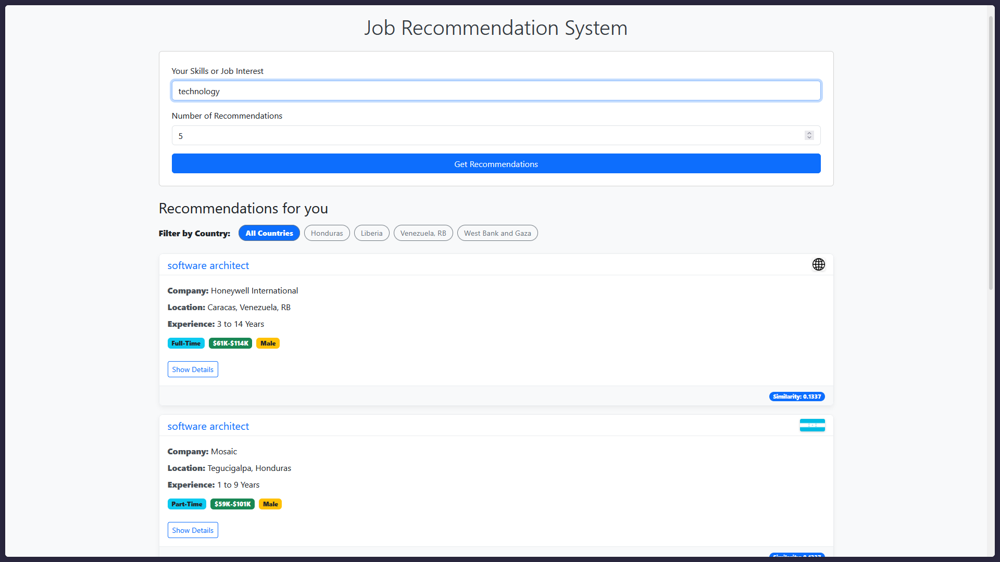
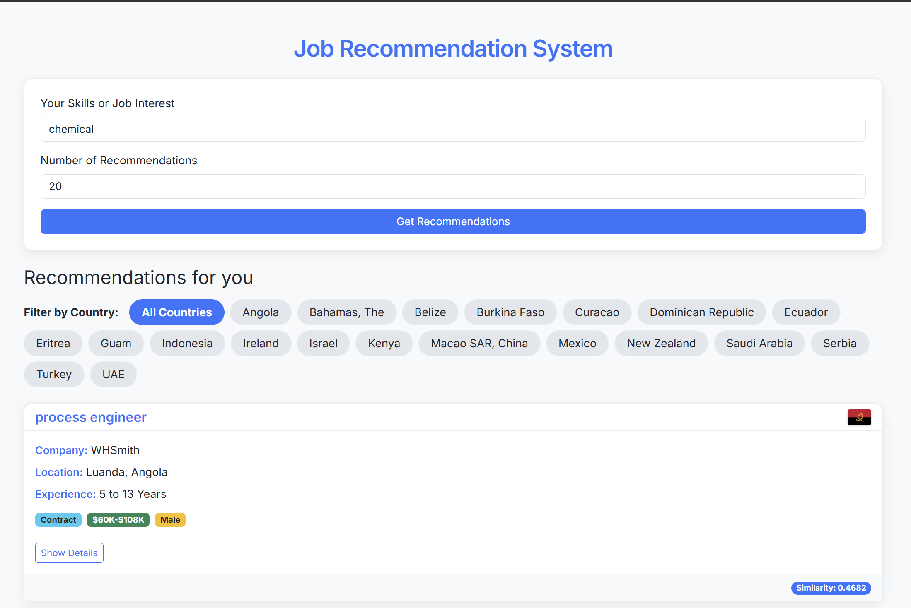

# FP-BigData-Kelompok5

## Sistem Rekomendasi Pekerjaan Berbasis Arsitektur Data Modern

Proyek ini mendemonstrasikan sistem rekomendasi pekerjaan secara _end-to-end_, mulai dari memproses data secara _streaming_, penyimpanan di _data lake_, pemrosesan dan pemodelan, hingga penyajian hasil melalui API. Arsitektur ini menggunakan Docker, Kafka, MinIO, Spark, dan Python untuk membangun alur kerja yang kokoh dan dapat diskalakan untuk kasus penggunaan data besar.

### Anggota

| Nama                      | NRP          |
| ------------------------- | ------------ |
| Maulana Ahmad Zahiri      | `5027231010` |
| Amoes Noland              | `5027231028` |
| Rafi' Afnaan Fathurrahman | `5027231040` |
| Danendra Fidel Khansa     | `5027231063` |
| Dimas Andhika Diputra     | `5027231074` |

---

### Daftar Isi

- [FP-BigData-Kelompok5](#fp-bigdata-kelompok5)
  - [Sistem Rekomendasi Pekerjaan Berbasis Arsitektur Data Modern](#sistem-rekomendasi-pekerjaan-berbasis-arsitektur-data-modern)
    - [Anggota](#anggota)
    - [Daftar Isi](#daftar-isi)
  - [Tentang Proyek](#tentang-proyek)
  - [Fitur Utama](#fitur-utama)
  - [Arsitektur Sistem](#arsitektur-sistem)
  - [Tumpukan Teknologi](#tumpukan-teknologi)
  - [Struktur Proyek](#struktur-proyek)
  - [Panduan Instalasi dan Penggunaan](#panduan-instalasi-dan-penggunaan)
    - [Prasyarat (Prerequisites)](#prasyarat-prerequisites)
    - [Persiapan Dataset](#persiapan-dataset)
    - [1. Setup Otomatis (Direkomendasikan)](#1-setup-otomatis-direkomendasikan)
    - [2. Setup Manual (Langkah-demi-Langkah)](#2-setup-manual-langkah-demi-langkah)
  - [Cara Menggunakan API](#cara-menggunakan-api)

---

## Tentang Proyek

Sistem ini dirancang untuk memberikan rekomendasi pekerjaan yang relevan kepada pengguna berdasarkan _query_ berupa keahlian atau minat pekerjaan. Pengguna dapat memasukkan deskripsi singkat, dan sistem akan mencocokkannya dengan ribuan lowongan pekerjaan menggunakan model _Machine Learning_ untuk menemukan yang paling sesuai.

---

## Fitur Utama

- **Data Real-time**: Menggunakan Kafka untuk mengalirkan data lowongan pekerjaan seolah-olah data tersebut datang secara terus-menerus.
- **Penyimpanan di Data Lake**: Memanfaatkan MinIO sebagai _object storage_ terpusat untuk menyimpan data mentah dalam format CSV.
- **Pemodelan Machine Learning**: Menggunakan PySpark untuk memproses data dalam jumlah besar dan membangun model rekomendasi berbasis **TF-IDF** dan **Cosine Similarity**.
- **Penyajian Melalui REST API**: Menyediakan endpoint API menggunakan Flask untuk memberikan rekomendasi secara _on-demand_.
- **Infrastruktur Terkontainerisasi**: Seluruh layanan (Kafka, MinIO, Spark, dll.) dijalankan dalam kontainer Docker untuk konsistensi dan kemudahan _deployment_.
- **Otomatisasi & Monitoring**: Dilengkapi dengan _script_ otomasi (`.sh`/`.bat`) untuk menjalankan alur kerja dan _dashboard_ monitoring sederhana untuk memantau status sistem.

---

## Arsitektur Sistem



Alur kerja sistem adalah sebagai berikut:

1.  **Sumber Data**: Dataset lowongan kerja dalam format CSV.
2.  **Streaming (Kafka)**: `producer.py` membaca dataset dan mengirimkannya baris per baris ke _topic_ Kafka `jobs-topic`.
3.  **Penyimpanan (MinIO)**: `consumer.py` yang berjalan di Docker menerima data dari Kafka dan menyimpannya secara periodik sebagai file CSV baru ke dalam MinIO, yang berfungsi sebagai _Data Lake_.
4.  **Query & Metadata (Trino & Hive)**: Trino digunakan untuk melakukan _query_ SQL secara langsung ke data di MinIO, sementara Hive Metastore mengelola skema dan metadata dari data tersebut.
5.  **ML Training (Spark)**: Secara berkala, `spark.py` mengambil semua data dari MinIO, memprosesnya, dan melatih model rekomendasi. Model yang sudah jadi disimpan sebagai file _pickle_.
6.  **Klien (API & Aplikasi)**: Pengguna berinteraksi dengan sistem melalui `app.py`, sebuah server API Flask yang memuat model terlatih dan memberikan rekomendasi pekerjaan.

---

## Tumpukan Teknologi

- **Backend**: Python, Flask
- **Data Pipeline**: Apache Kafka, Apache Spark
- **Penyimpanan**: MinIO (S3-compatible Data Lake), MariaDB (untuk Hive Metastore)
- **Query Engine**: Trino
- **Metadata Management**: Hive Metastore
- **Deployment**: Docker & Docker Compose
- **Scripting**: Bash (Linux/macOS), Batch (Windows)
- **Library Utama**: PySpark, Scikit-learn, Pandas, MinIO Client, Kafka-Python

---

## Struktur Proyek

```
.
├── README.md
├── app.py
├── automation.py
├── conf
│   └── metastore-site.xml
├── docker-compose.yml
├── etc
│   ├── catalog
│   │   ├── minio.properties
│   │   ├── tpcds.properties
│   │   └── tpch.properties
│   ├── config.properties
│   ├── jvm.config
│   ├── log.properties
│   └── node.properties
├── kafka
│   ├── Dockerfile
│   ├── consumer.py
│   ├── dataset.csv
│   ├── producer.py
|   ├── flagminio.py
│   └── requirements.txt
├── monitor_dashboard.py
├── requirements.txt
├── run_automation.bat
├── run_automation.sh
├── spark.py
├── static
│   ├── script.js
│   └── style.css
└── templates
    └── index.html
```

## Panduan Instalasi dan Penggunaan

### Prasyarat (Prerequisites)

Pastikan perangkat Anda telah terinstal:

- **Docker** & **Docker Compose**: Untuk menjalankan seluruh infrastruktur dalam kontainer.
- **Python 3.8+**: Untuk menjalankan _script_ aplikasi dan pemodelan.

### Persiapan Dataset

Dataset yang digunakan: [Job Description Dataset di Kaggle](https://www.kaggle.com/datasets/ravindrasinghrana/job-description-dataset)

Untuk melakukan download, pastikan berada di root project folder, dan jalankan:

```sh
chmod +x download_dataset.sh
./download_dataset.sh
```

Script tersebut akan secara otomatis melakukan download dataset, unzip, dan rename sesuai keperluan Python Producer.

### 1. Setup Otomatis (Direkomendasikan)

Metode ini menggunakan _script_ `run_automation` untuk menjalankan dan memonitor alur kerja secara berkelanjutan.

**Langkah 1: Clone & Siapkan Lingkungan**

```bash
git clone https://github.com/danendrafidel/FP-BigData-Kelompok5.git
cd FP-BigData-Kelompok5

python -m venv venv

# Linux/macOS
source venv/bin/activate

# Windows
.\venv\Scripts\activate

pip install -r requirements.txt
```

**Langkah 2: Jalankan Infrastruktur**

Pertama build compose untuk `docker-compose.yml`

```bash
docker-compose up -d
```

Kemudian hal kedua yang perlu dijalankan (jika manual di terminal)

```bash
python kafka/producer.py
python kafka/flagminio.py /*bendera sebagai unstructured data*/
```

Sebuah bucket "jobs" dan "flags" untuk MinIO secara otomatis dibuat oleh Docker Compose. Namun bila ingin memastikan isi dari bucket "jobs" dan "flags", bisa dilakukan login dengan cara:

1.  Buka browser dan akses MinIO Console di `http://localhost:9001`.
2.  Login dengan kredensial: **Access Key**: `minio_access_key` / **Secret Key**: `minio_secret_key`.
3.  Bila bucket "jobs" dan "flags" sudah ada, maka akan terlihat di Object Browser seperti gambar di bawah ini.


**Langkah 3: Jalankan Script Otomasi**

_Script_ ini akan menangani pengiriman data dan _training_ model secara periodik.

- **Untuk Pengguna Linux/macOS:**
  ```bash
  chmod +x run_automation.sh
  ./run_automation.sh start
  ```
- **Untuk Pengguna Windows:**
  ```bat
  run_automation.bat
  ```

Producer akan mengirim seluruh data dari `dataset.csv` ke Kafka. Consumer yang berjalan di Docker akan menerimanya dan menyimpannya ke MinIO. Berikut adalah contoh log yang diberikan oleh consumer saat menerima data:



Setelah MinIO menerima banyak batch yang cukup, Spark trainer akan membuat model dan menyimpannya di folder `models_tfidf/`.

**Langkah 4: Jalankan API Server**

Setelah mendapatkan model hasil Spark training, maka API server dapat bekerja saat dinyalakan dengan cara:

```bash
python app.py
```

Server API sekarang siap menerima permintaan di `http://localhost:4000`.

### 2. Setup Manual (Langkah-demi-Langkah)

Gunakan metode ini jika Anda ingin menjalankan setiap komponen secara terpisah.

**Langkah 1-2**: Ikuti **Langkah 1 dan 2** dari **Setup Otomatis** (clone, siapkan venv, jalankan Docker, dan buat bucket MinIO).

**Langkah 3: Kirim Data dengan Producer**

```bash
python kafka/producer.py
python kafka/flagminio.py /*bendera sebagai unstructured data*/
```

Producer akan mengirim seluruh data dari `dataset.csv` ke Kafka. Consumer yang berjalan di Docker akan menerimanya dan menyimpannya ke MinIO. Berikut adalah contoh log yang diberikan oleh consumer saat menerima data:


**Langkah 5: Latih Model Machine Learning**

Beri waktu sekitar 2-3 menit agar Consumer menyimpan data ke MinIO, lalu jalankan _script training_ secara manual:

```bash
python spark.py
```

Script ini akan membuat model dan menyimpannya di folder `models_tfidf/`.

**Langkah 6: Jalankan API Server**

Setelah mendapatkan model hasil Spark training, maka API server dapat bekerja saat dinyalakan dengan cara:

```bash
python app.py
```

Server API sekarang siap menerima permintaan di `http://localhost:4000`.

---

## Cara Menggunakan API

Anda dapat menguji API menggunakan `curl` atau membuka antarmuka web di `http://localhost:4000` di browser Anda.

**Contoh Uji Coba dengan `curl`:**

```bash
curl -X POST http://localhost:4000/recommend/query \
-H "Content-Type: application/json" \
-d '{"query": "software developer", "top_n": 3}'
```

**Contoh Respon yang Diharapkan:**


**Contoh Uji Coba dengan web:**



**Rekomendasi maksimal adalah 20 rekomendasi pekerjaan**

