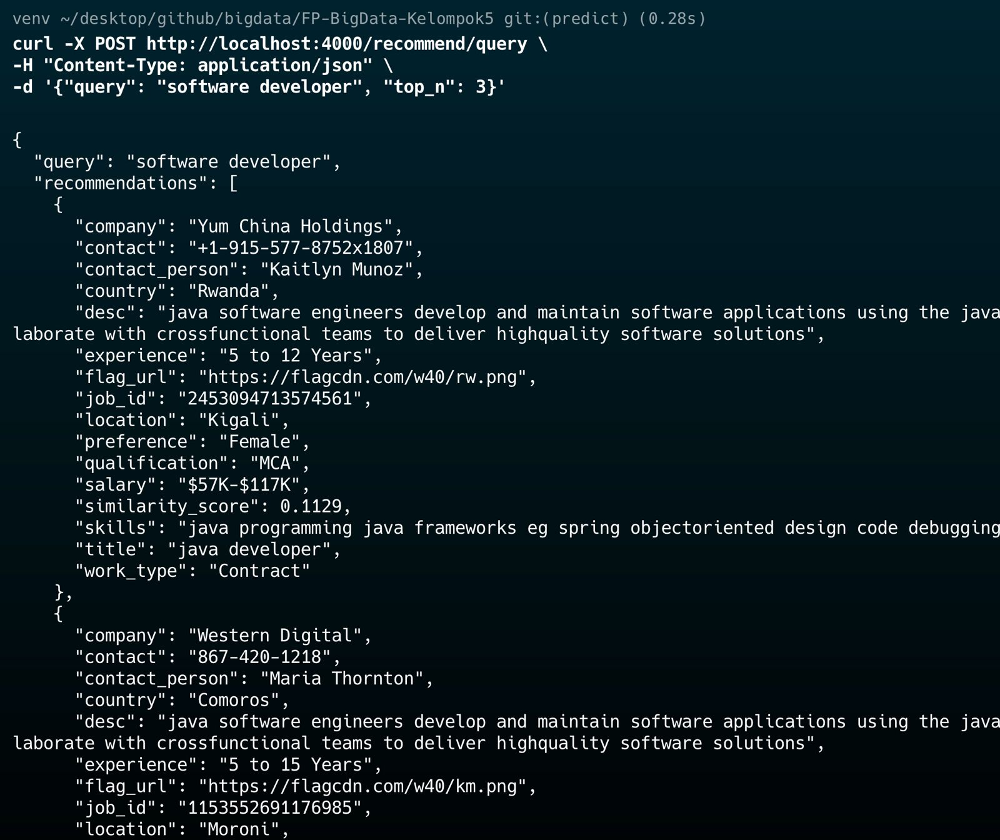

# FP-BigData-Kelompok5

## Sistem Rekomendasi Pekerjaan Berbasis Arsitektur Data Modern

Proyek ini mendemonstrasikan sistem rekomendasi pekerjaan secara *end-to-end*, mulai dari ingesti data secara *streaming*, penyimpanan di *data lake*, pemrosesan dan pemodelan, hingga penyajian hasil melalui API. Arsitektur ini menggunakan Docker, Kafka, MinIO, Spark, dan Python untuk membangun alur kerja yang kokoh dan dapat diskalakan untuk kasus penggunaan data besar.

### Anggota

| Nama           | NRP          |
| -------------- | ------------ |
| Maulana Ahmad  | `5027231010` |
| Amoes Noland   | `5027231028` |
| Rafi Afnaan    | `5027231040` |
| Danendra Fidel | `5027231063` |
| Dimas Andhika  | `5027231074` |

---

### Daftar Isi
- [Tentang Proyek](#tentang-proyek)
- [Fitur Utama](#fitur-utama)
- [Arsitektur Sistem](#arsitektur-sistem)
- [Tumpukan Teknologi](#tumpukan-teknologi)
- [Struktur Proyek](#struktur-proyek)
- [Panduan Instalasi dan Penggunaan](#panduan-instalasi-dan-penggunaan)
  - [Prasyarat](#prasyarat-prerequisites)
  - [Persiapan Dataset](#persiapan-dataset)
  - [Setup Otomatis (Direkomendasikan)](#1-setup-otomatis-direkomendasikan)
  - [Setup Manual (Langkah-demi-Langkah)](#2-setup-manual-langkah-demi-langkah)
- [Cara Menggunakan API](#cara-menggunakan-api)

---

## Tentang Proyek

Sistem ini dirancang untuk memberikan rekomendasi pekerjaan yang relevan kepada pengguna berdasarkan *query* berupa keahlian atau minat pekerjaan. Pengguna dapat memasukkan deskripsi singkat, dan sistem akan mencocokkannya dengan ribuan lowongan pekerjaan menggunakan model *Machine Learning* untuk menemukan yang paling sesuai.

---

## Fitur Utama

- **Data Real-time**: Menggunakan Kafka untuk mengalirkan data lowongan pekerjaan seolah-olah data tersebut datang secara terus-menerus.
- **Penyimpanan di Data Lake**: Memanfaatkan MinIO sebagai *object storage* terpusat untuk menyimpan data mentah dalam format CSV.
- **Pemodelan Machine Learning**: Menggunakan PySpark untuk memproses data dalam jumlah besar dan membangun model rekomendasi berbasis **TF-IDF** dan **Cosine Similarity**.
- **Penyajian Melalui REST API**: Menyediakan endpoint API menggunakan Flask untuk memberikan rekomendasi secara *on-demand*.
- **Infrastruktur Terkontainerisasi**: Seluruh layanan (Kafka, MinIO, Spark, dll.) dijalankan dalam kontainer Docker untuk konsistensi dan kemudahan *deployment*.
- **Otomatisasi & Monitoring**: Dilengkapi dengan *script* otomasi (`.sh`/`.bat`) untuk menjalankan alur kerja dan *dashboard* monitoring sederhana untuk memantau status sistem.

---

## Arsitektur Sistem


Alur kerja sistem adalah sebagai berikut:
1.  **Sumber Data**: Dataset lowongan kerja dalam format CSV.
2.  **Streaming (Kafka)**: `producer.py` membaca dataset dan mengirimkannya baris per baris ke *topic* Kafka `jobs-topic`.
3.  **Penyimpanan (MinIO)**: `consumer.py` yang berjalan di Docker menerima data dari Kafka dan menyimpannya secara periodik sebagai file CSV baru ke dalam MinIO, yang berfungsi sebagai *Data Lake*.
4.  **Query & Metadata (Trino & Hive)**: Trino digunakan untuk melakukan *query* SQL secara langsung ke data di MinIO, sementara Hive Metastore mengelola skema dan metadata dari data tersebut.
5.  **ML Training (Spark)**: Secara berkala, `spark.py` mengambil semua data dari MinIO, memprosesnya, dan melatih model rekomendasi. Model yang sudah jadi disimpan sebagai file *pickle*.
6.  **Klien (API & Aplikasi)**: Pengguna berinteraksi dengan sistem melalui `app.py`, sebuah server API Flask yang memuat model terlatih dan memberikan rekomendasi pekerjaan.

---

## Tumpukan Teknologi

- **Backend**: Python, Flask
- **Data Pipeline**: Apache Kafka, Apache Spark
- **Penyimpanan**: MinIO (S3-compatible Data Lake), MariaDB (untuk Hive Metastore)
- **Query Engine**: Trino
- **Metadata Management**: Hive Metastore
- **Deployment**: Docker & Docker Compose
- **Scripting**: Bash (Linux/macOS), Batch (Windows)
- **Library Utama**: PySpark, Scikit-learn, Pandas, MinIO Client, Kafka-Python

---

## Struktur Proyek
```
.
├── README.md
├── app.py
├── automation.py
├── conf
│   └── metastore-site.xml
├── docker-compose.yml
├── etc
│   ├── catalog
│   │   ├── minio.properties
│   │   ├── tpcds.properties
│   │   └── tpch.properties
│   ├── config.properties
│   ├── jvm.config
│   ├── log.properties
│   └── node.properties
├── kafka
│   ├── Dockerfile
│   ├── consumer.py
│   ├── dataset.csv
│   ├── producer.py
│   └── requirements.txt
├── monitor_dashboard.py
├── requirements.txt
├── run_automation.bat
├── run_automation.sh
├── spark.py
├── static
│   ├── script.js
│   └── style.css
└── templates
    └── index.html
```

## Panduan Instalasi dan Penggunaan

### Prasyarat (Prerequisites)
Pastikan perangkat Anda telah terinstal:
-   **Docker** & **Docker Compose**: Untuk menjalankan seluruh infrastruktur dalam kontainer.
-   **Python 3.8+**: Untuk menjalankan *script* aplikasi dan pemodelan.

### Persiapan Dataset
1.  **Unduh Dataset**: Buka tautan Kaggle berikut dan unduh file `job_descriptions.csv`.
    -   **Sumber**: [Job Description Dataset di Kaggle](https://www.kaggle.com/datasets/ravindrasinghrana/job-description-dataset)
2.  **Pindahkan dan Ganti Nama File**:
    -   Pindahkan file yang telah diunduh ke dalam direktori `kafka/`.
    -   **PENTING**: Ganti nama file dari `job_descriptions.csv` menjadi **`dataset.csv`**.

### 1. Setup Otomatis (Direkomendasikan)
Metode ini menggunakan *script* `run_automation` untuk menjalankan dan memonitor alur kerja secara berkelanjutan.

**Langkah 1: Clone & Siapkan Lingkungan**
```bash
git clone https://github.com/danendrafidel/FP-BigData-Kelompok5.git
cd FP-BigData-Kelompok5

python -m venv venv

# Linux/macOS
source venv/bin/activate

# Windows
.\venv\Scripts\activate

pip install -r requirements.txt
```

**Langkah 2: Jalankan Infrastruktur & Buat Bucket**
```bash
docker-compose up -d
```
Tunggu beberapa saat hingga semua kontainer berjalan. Lalu, konfigurasikan MinIO:
1.  Buka browser dan akses MinIO Console di `http://localhost:9001`.
2.  Login dengan kredensial: **Access Key**: `minio_access_key` / **Secret Key**: `minio_secret_key`.
3.  Buat *bucket* baru dengan nama **`jobs`**.

**Langkah 3: Jalankan Script Otomasi**

*Script* ini akan menangani pengiriman data dan *training* model secara periodik.

-   **Untuk Pengguna Linux/macOS:**
    ```bash
    chmod +x run_automation.sh
    ./run_automation.sh start
    ```
-   **Untuk Pengguna Windows:**
    ```bat
    run_automation.bat
    ```

**Langkah 4: Jalankan API Server**

Setelah otomasi berjalan (tunggu sekitar 2-3 menit agar data awal terkirim dan model pertama dibuat), buka terminal **baru** (dengan *virtual environment* yang sama) dan jalankan API server:
```bash
python app.py
```
Server API akan berjalan di `http://localhost:4000`.

### 2. Setup Manual (Langkah-demi-Langkah)
Gunakan metode ini jika Anda ingin menjalankan setiap komponen secara terpisah.

**Langkah 1-2**: Ikuti **Langkah 1 dan 2** dari **Setup Otomatis** (clone, siapkan venv, jalankan Docker, dan buat bucket MinIO).

**Langkah 3: Kirim Data dengan Producer**
```bash
python kafka/producer.py
```
Producer akan mengirim seluruh data dari `dataset.csv` ke Kafka. Consumer yang berjalan di Docker akan menerimanya dan menyimpannya ke MinIO.

**Langkah 4: Latih Model Machine Learning**

Beri waktu sekitar 2-3 menit agar Consumer menyimpan data ke MinIO, lalu jalankan *script training* secara manual:
```bash
python spark.py
```
Script ini akan membuat model dan menyimpannya di folder `models_tfidf/`.

**Langkah 5: Jalankan API Server**

```bash
python app.py
```
Server API sekarang siap menerima permintaan di `http://localhost:4000`.

---

## Cara Menggunakan API
Anda dapat menguji API menggunakan `curl` atau membuka antarmuka web di `http://localhost:4000` di browser Anda.

**Contoh Uji Coba dengan `curl`:**
```bash
curl -X POST http://localhost:4000/recommend/query \
-H "Content-Type: application/json" \
-d '{"query": "software developer", "top_n": 3}'
```

**Contoh Respon yang Diharapkan:**
