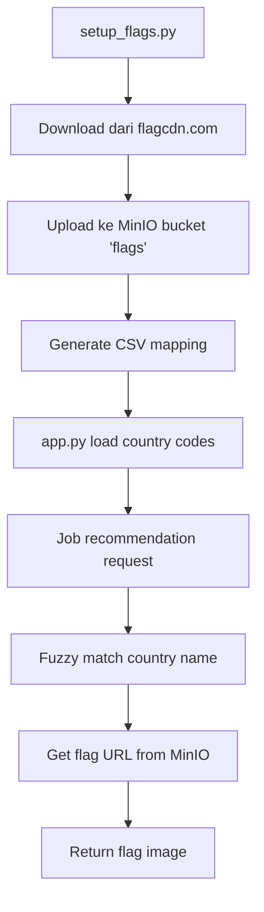

# 🚩 Flag System for Job Recommendation

Sistem flag untuk menampilkan bendera negara pada job recommendations. Menggunakan dataset lokal yang di-stream ke MinIO untuk project Big Data.

## 📋 Overview

Sistem ini terdiri dari:

- **Dataset Flag**: Mengunduh flag dari flagcdn.com
- **MinIO Storage**: Menyimpan flag di bucket "flags"
- **Flask Integration**: Serve flag via endpoint `/flag/<country_code>.svg`
- **Fuzzy Matching**: Match nama negara dengan country code

## 🔄 Alur Kerja



## 📁 File Structure

```
FP-BigData-Kelompok5/
├── setup_flags.py          # Setup dataset & upload ke MinIO
├── check_minio.py          # Cek isi MinIO bucket
├── test_flags.py           # Test flag endpoints
├── app.py                  # Flask app dengan flag system
├── kafka/
│   └── flags.csv          # Country code mapping
└── data/
    └── flags/             # Dataset flag (existing)
```

## 🚀 Cara Penggunaan

### 1. Setup Flag System

```bash
# Download flag dataset dan upload ke MinIO
python setup_flags.py
```

**Output:**

```
✅ Bucket 'flags' dibuat
📊 Dataset flag: 130 negara
📤 Uploading flags ke MinIO...
✅ Indonesia (id)
✅ United States (us)
...
🎉 Setup selesai!
✅ Success: 130 flags
📁 CSV saved: kafka/flags.csv
```

### 2. Cek MinIO Bucket

```bash
# Verifikasi upload berhasil
python check_minio.py
```

**Output:**

```
✅ Bucket 'flags' ditemukan
📊 Total files: 130
📋 Sample files:
   • id.svg
   • us.svg
   • sg.svg
...
🧪 Testing important flags:
   ✅ id.svg: 1234 bytes
   ✅ us.svg: 2345 bytes
...
🎉 MinIO bucket ready!
```

### 3. Jalankan Flask App

```bash
# Start aplikasi dengan flag system
python app.py
```

**Features:**

- ✅ Load country codes dari CSV
- ✅ Fuzzy matching untuk nama negara
- ✅ Serve flag dari MinIO via `/flag/<country_code>.svg`
- ✅ Integrasi dengan job recommendations

### 4. Test Flag System

```bash
# Test flag endpoints
python test_flags.py
```

**Output:**

```
🧪 Testing Flag System
Testing: id.svg
   ✅ SUCCESS - 1234 bytes
Testing: us.svg
   ✅ SUCCESS - 2345 bytes
...
📊 Results:
   ✅ Success: 10
   ❌ Failed: 0
🎉 Flag system working!
```

## 🌐 API Endpoints

### Flag Endpoint

```
GET /flag/<country_code>.svg
```

**Contoh:**

- `http://localhost:4000/flag/id.svg` - Flag Indonesia
- `http://localhost:4000/flag/us.svg` - Flag United States
- `http://localhost:4000/flag/sg.svg` - Flag Singapore

### Job Recommendation Endpoint

```
POST /recommend/query
```

**Response includes:**

```json
{
  "recommendations": [
    {
      "title": "Software Engineer",
      "country": "Indonesia",
      "flag_url": "/flag/id.svg",
      "latitude": -2.5489,
      "longitude": 118.0149,
      ...
    }
  ]
}
```

## 🔧 Konfigurasi

### MinIO Settings

```python
minio_client = Minio(
    "localhost:9000",
    access_key="minio_access_key",
    secret_key="minio_secret_key",
    secure=False
)
```

### Fuzzy Matching Threshold

```python
# Di app.py - line ~150
if score >= 70:  # Lowered threshold dari 80 ke 70
    return country_code_map[match]
```

### Special Country Mappings

```python
special_mappings = {
    'united states': 'us',
    'usa': 'us',
    'united kingdom': 'gb',
    'uk': 'gb',
    'netherlands': 'nl',
    'holland': 'nl',
    # ... lebih banyak mapping
}
```

## 📊 Dataset Information

### Countries Covered

- **Asia**: Indonesia, Singapore, Malaysia, India, Japan, China, South Korea, Thailand, Vietnam, Philippines, Taiwan, Hong Kong
- **Europe**: Germany, United Kingdom, Netherlands, France, Italy, Spain, Switzerland, Austria, Belgium, Denmark, Finland, Norway, Sweden
- **Americas**: United States, Canada
- **Oceania**: Australia, New Zealand
- **Africa**: South Africa, Egypt, Morocco, Algeria, Tunisia, Libya, Sudan, Ethiopia, Kenya, Uganda, Tanzania, Rwanda, Burundi, Nigeria, Ghana
- **Middle East**: Saudi Arabia, UAE, Qatar, Kuwait, Oman, Yemen, Israel, Lebanon, Jordan, Syria, Iraq, Iran, Turkey
- **Dan 80+ negara lainnya**

### File Format

- **Format**: SVG (Scalable Vector Graphics)
- **Source**: flagcdn.com
- **Storage**: MinIO bucket "flags"
- **Naming**: `{country_code}.svg` (lowercase)

## 🛠️ Troubleshooting

### MinIO Connection Error

```
❌ Error: Connection refused
💡 Pastikan MinIO server running:
   docker-compose up -d
```

### Flag Not Found

```
❌ Flag tidak muncul di job recommendations
💡 Cek:
   1. python setup_flags.py sudah dijalankan
   2. Country name match dengan CSV
   3. Fuzzy matching threshold
```

### Flask App Error

```
❌ Models not loaded
💡 Pastikan file model ada di models_tfidf/
```

## 🔄 Workflow untuk Big Data

1. **Data Ingestion**: Flag dataset diunduh dari flagcdn.com
2. **Data Storage**: Flag disimpan di MinIO bucket "flags"
3. **Data Processing**: CSV mapping dibuat untuk country codes
4. **Data Serving**: Flask app serve flag dari MinIO
5. **Data Integration**: Flag ditampilkan di job recommendations

## 📈 Performance

- **Upload Speed**: ~130 flags dalam 2-3 menit
- **Response Time**: <100ms untuk flag serving
- **Storage**: ~50KB total untuk semua flag SVG
- **Cache**: MinIO sebagai cache layer

## 🎯 Benefits

- ✅ **Big Data Friendly**: Dataset lokal, bukan API real-time
- ✅ **Scalable**: MinIO sebagai object storage
- ✅ **Fast**: SVG format, lightweight
- ✅ **Reliable**: Fuzzy matching untuk variasi nama negara
- ✅ **Integrated**: Terintegrasi dengan job recommendation system

## 📝 Notes

- Script `setup_flags.py` hanya perlu dijalankan sekali
- Flag akan otomatis muncul di job recommendations
- Jika ada country baru, tambahkan ke `flags_data` di `setup_flags.py`
- MinIO bucket "flags" akan dibuat otomatis jika belum ada
